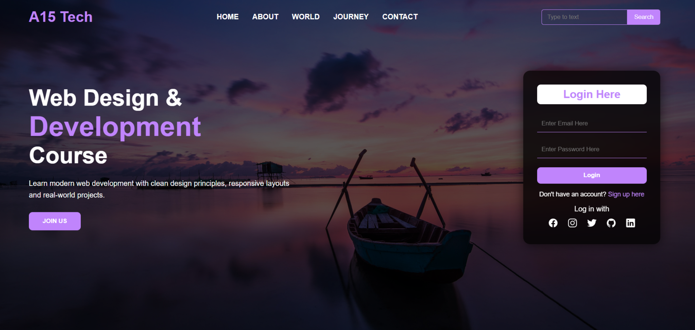

# A15 Tech – Landing Page with Login UI

## 📸 Preview

---

## 📌 About This Project

This is a landing page UI project built using HTML and CSS as part of my frontend practice.

The design includes a navigation bar, hero section, search bar, and a styled login form.  
The main focus of this project was layout structuring and UI styling.

This project does not include backend functionality. The login form is for design purposes only.

---

## 🚀 Features

- Navigation bar with menu links
- Search input and button
- Hero section with highlighted heading
- "Join Us" call-to-action button
- Styled login form
- Social media icons using Ionicons
- Background image with dark gradient overlay
- Hover effects and transitions

---

## 🛠️ Technologies Used

- HTML5  
- CSS3  
- Flexbox  
- CSS Variables  
- Ionicons  

---

## 🧠 What I Practiced

- Layout alignment using Flexbox  
- Creating a background overlay with `linear-gradient()`  
- Styling forms and input fields  
- Using CSS transitions and hover effects  
- Organizing clean and readable HTML structure  
- Creating a glass-like login card using `backdrop-filter`  

---

## 📂 Project Structure

A15-Tech/
│
├── index.html  
├── style.css  
├── back.jpg  
└── README.md  

---

## ⚠️ Current Limitations

- Not fully responsive for smaller screens  
- No JavaScript form validation  
- No backend authentication  

---

## 🔮 Future Improvements

- Make it fully responsive  
- Add JavaScript validation  
- Connect to backend for authentication  
- Improve spacing and accessibility  

---

Built as part of my web development learning journey.
